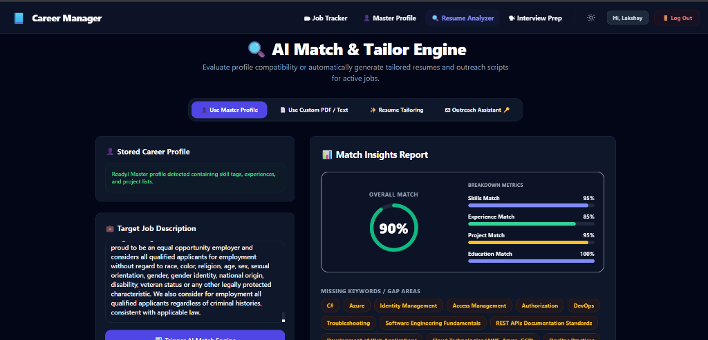
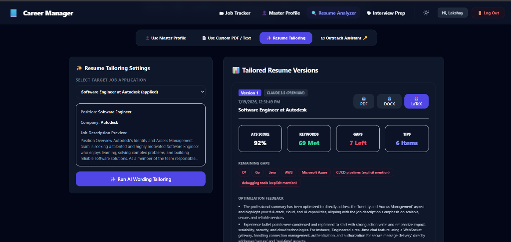
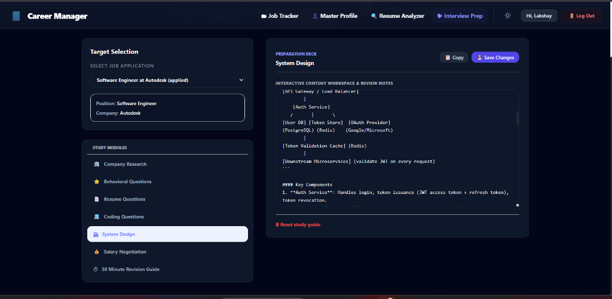
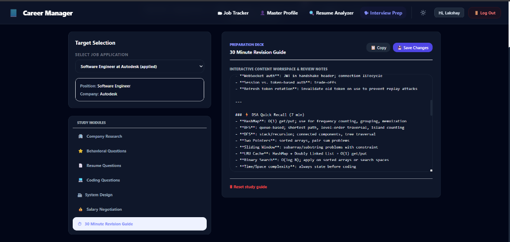
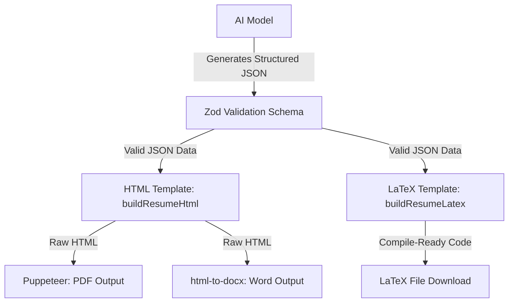

# CareerOS: AI-Powered Job Application & Interview Prep Suite

CareerOS (Career Manager) is a production-grade, full-stack application designed to help software engineers track, analyze, and optimize their job applications. By leveraging state-of-the-art Large Language Models (LLMs) alongside a deterministic rendering pipeline, CareerOS simplifies the job search process from profile creation to final interview preparation.

---

## 📸 Core Features & Walkthrough

### 1. AI Match & Tailor Engine
Before tailoring your resume, the matching engine evaluates the compatibility between your **Master Career Profile** and the **Target Job Description**. 
* **Match Metrics:** Generates detailed compatibility scores across Skills, Experience, Projects, and Education.
* **Gap Analysis:** Instantly surfaces missing keywords and gap areas (e.g., specific languages, DevOps practices, cloud services) to help you understand what's missing.



### 2. Intelligent Resume Tailoring
Tailor your experience specifically for a target job application at the click of a button.
* **ATS Score Optimization:** The AI rephrases and highlights experience points, yielding high ATS compatibility.
* **Multi-Format Export:** Downloads the tailored resume in three distinct formats:
  - 📄 **PDF** — Renders beautifully using a headless Chrome instance.
  - 📝 **Word (DOCX)** — Converts the layout into a clean, editable `.docx` file.
  - ⚙️ **LaTeX (TEX)** — Generates compile-ready LaTeX source code for further customization in Overleaf.



### 3. Interactive Interview Preparation
Once you apply, CareerOS builds tailored preparation modules.
* **Tailored Decks:** Modules covering Company Research, Behavioral Questions, Resume-specific Q&A, and Coding.
* **System Design & DSA Cheat Sheets:** Access interactive block diagrams, system architectures, and core DSA revision guides.
* **Note Workspace:** Edit and save your review notes directly within the dashboard.

| System Design Deck | 30-Minute Revision Guide |
| :---: | :---: |
|  |  |

---

## 🛠 Architectural Design: Multi-Format Rendering Pipeline

To prevent layout breakages and formatting drift, the rendering architecture separates **content optimization** from **layout rendering**:



1. **AI Output Narrowed to JSON:** The AI is instructed to return *only* a structured JSON payload containing resume content. It never generates raw markup, preventing broken HTML tags or LaTeX errors.
2. **Schema Enforcement (Zod):** The backend validates the AI's JSON output against `ResumeContentSchema`. If the structure is missing fields, it fails early and prevents corrupted files from writing to disk.
3. **Single Source of Truth HTML:** Validated JSON is mapped to a static CSS/HTML template (`resumeTemplate.js`).
4. **Deterministic PDF & Word Compilation:** Puppeteer prints the HTML to a premium A4 PDF with exact margins (`A4`, `14mm 12mm` margins), while `html-to-docx` compiles the exact same markup into a Word document.
5. **Deterministic LaTeX Generator:** The JSON is processed by `resumeLatexTemplate.js` to escape special characters (e.g. `&` $\rightarrow$ `\&`, `%` $\rightarrow$ `\%`) and translate markdown bold formats (`**text**` $\rightarrow$ `\textbf{text}`) to generate a clean, compile-ready LaTeX document.

---

## 🧠 AI Model Usage & Prompt Engineering

### LLM Choices: Division of Labor
* **Claude 3.5 Sonnet (Premium):** Chosen for resume tailoring, writing outreach messages, and structuring interview preparation guides. Its superior capability in linguistic synthesis ensures that rewritten resume bullets sound natural, have impact, and align with job descriptions without fabricating facts.
* **Gemini 1.5 Pro / Flash:** Utilized for high-speed resume parsing, structured data extraction from Master Career Profiles, and rapid keyword gap analysis.

### Prompt Engineering Patterns
Our prompt engineering rules are designed to prevent AI hallucinations and keep formatting safe:
* **Factual Grounding:** Prompts explicitly prohibit the fabrication of metrics, experiences, or credentials. The AI is limited to choosing, sorting, and rephrasing facts present in the user's Master Profile JSON.
* **JSON-Only Response Instruction:** Prompts end with strict instructions to return raw, unescaped JSON without markdown code fences to prevent JSON parsing errors.

---

## 🚀 How to Run the Project (Monorepo Setup)

This repository is configured as a single NPM Workspace, allowing you to manage dependencies and boot both the frontend and backend simultaneously with unified commands.

### Prerequisites
- **Node.js** (v18 or higher)
- **MongoDB** (Local instance or Atlas connection string)

### 1. Setup Backend Environment Variables
Create a `.env` file inside the `backend/` directory:
```bash
# In backend/.env
PORT=5000
MONGO_URI=your_mongodb_connection_string
JWT_SECRET=your_jwt_signing_secret
FORGE_API_KEY=your_gemini_or_claud_orchestrator_key
```

### 2. Install All Dependencies
From the **root directory**, install packages for both frontend and backend using a single command:
```bash
npm install
```

### 3. Run the Application
Start both the Express API and the Vite React frontend concurrently with one command from the **root directory**:
```bash
npm run dev
```

The server will be up on [http://localhost:5000](http://localhost:5000), and the React web app will open automatically on [http://localhost:5173](http://localhost:5173).
