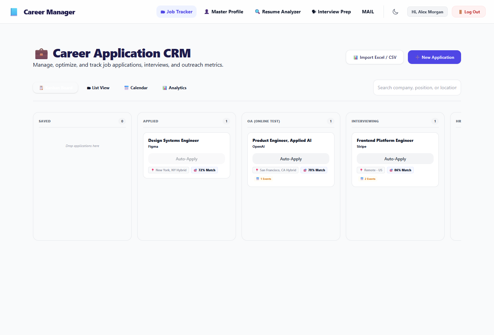
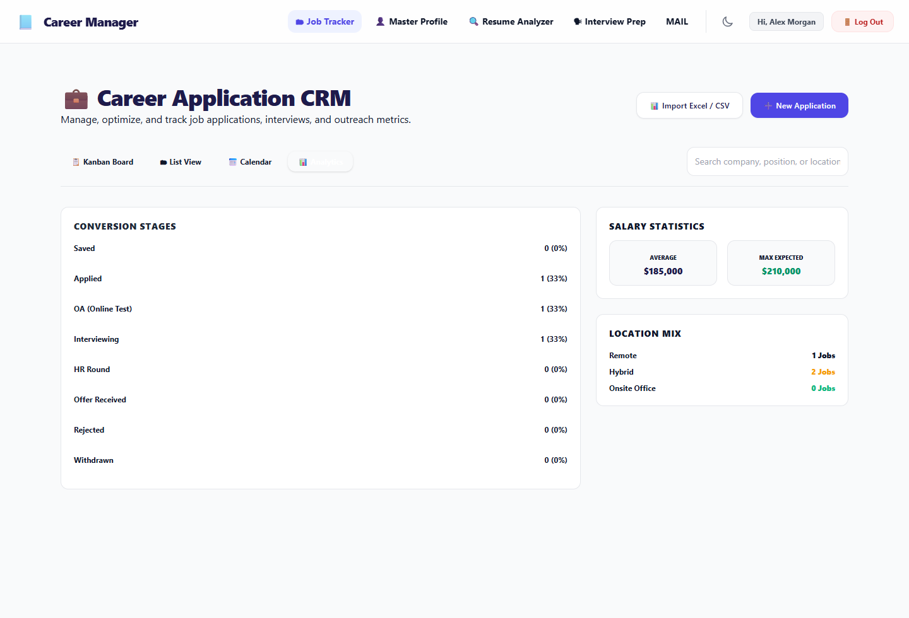
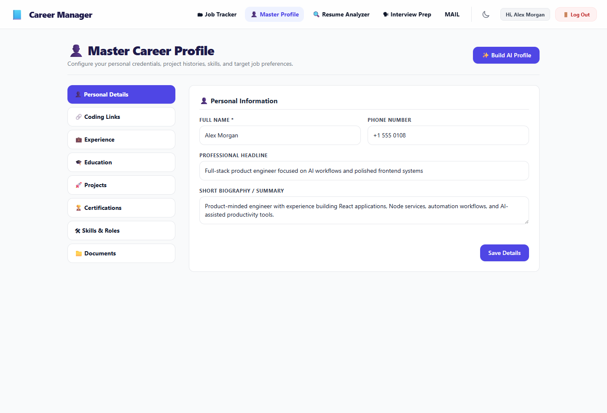
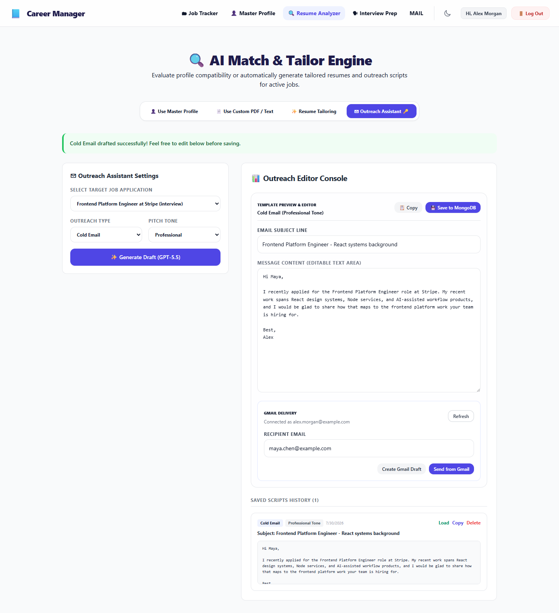
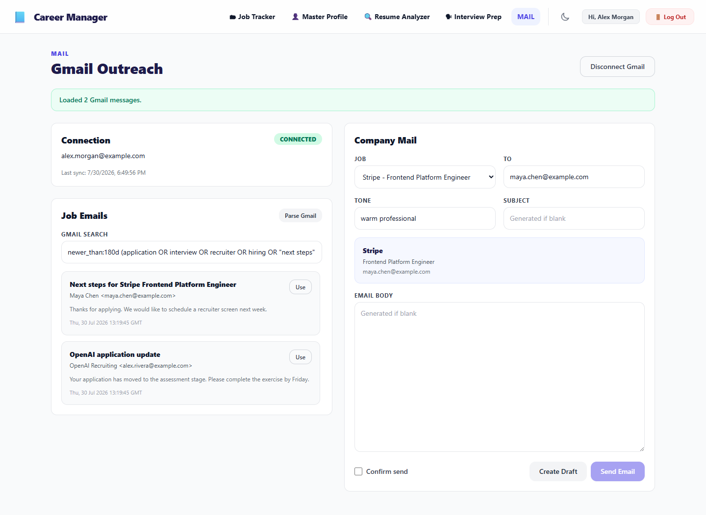
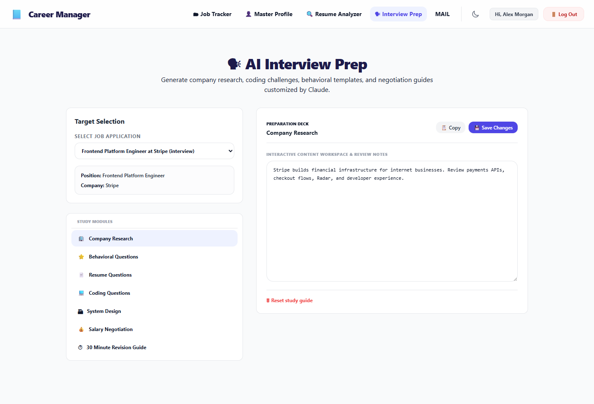
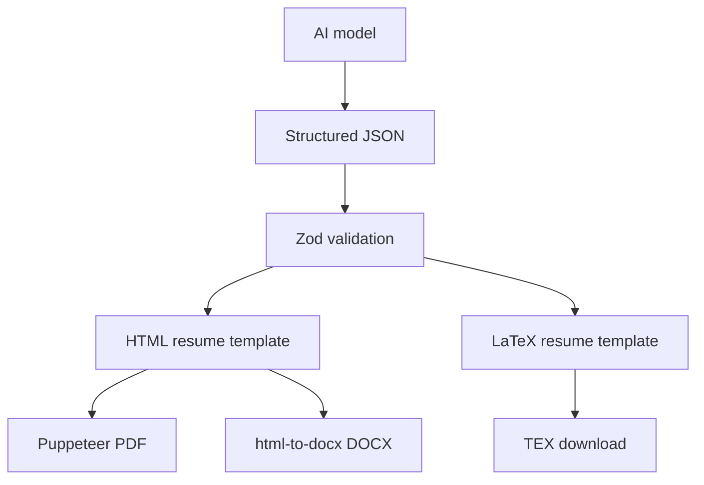

# CareerOS

CareerOS is a full-stack job-search operating system for tracking applications, building a master career profile, tailoring resumes, preparing for interviews, and sending personalized recruiter outreach through Gmail.

Live app: [career-os-job-tracker-app.vercel.app](https://career-os-job-tracker-app.vercel.app/)

## Product Screenshots

| Job Tracker CRM | Analytics Dashboard |
|---|---|
|  |  |

| Master Profile | Outreach Assistant with Gmail |
|---|---|
|  |  |

| MAIL Gmail Workspace | Interview Prep |
|---|---|
|  |  |

## What CareerOS Does

### Job Tracker CRM

- Track applications across `Saved`, `Applied`, `OA`, `Interview`, `HR`, `Offer`, `Rejected`, and `Withdrawn`.
- Switch between Kanban, list, calendar, and analytics views.
- Search jobs by company, role, and location.
- Store recruiter details, salary, job source, notes, job descriptions, checklist items, and timeline events.
- Import Excel/CSV job sheets and choose which parsed jobs to save.
- Paste raw job descriptions and use AI extraction to prefill company, role, location, salary, and description fields.

### Auto-Apply Assistant

- Builds a readiness plan before launching automation.
- Checks whether the job URL, profile details, and resume file are available.
- Uses the latest tailored resume PDF if one exists, otherwise falls back to the uploaded profile resume.
- Opens a headed Playwright browser and pre-fills application forms for common ATS flows such as Greenhouse, Lever, Ashby, Workday, and generic forms.
- Stops for human review before final submission.
- Updates the job timeline after completion.

### Master Career Profile

- Central profile for name, contact details, headline, bio, profile links, coding profiles, education, experience, projects, certifications, skills, and career preferences.
- Uploads resume and portfolio files.
- Extracts readable resume text from PDFs for AI workflows.
- AI profile builder can merge resume/profile inputs into a richer career profile.

### AI Match and Resume Tailoring

- Compares a saved job description against the master profile or custom resume text.
- Produces match insights, strengths, missing keywords, and tailoring suggestions.
- Generates tailored resume versions for each job.
- Exports tailored resumes as PDF, DOCX, and LaTeX/TEX.
- Uses structured JSON validation before rendering resumes so malformed AI output does not corrupt generated files.

### Outreach Assistant

- Generates cover letters, cold emails, referral requests, follow-ups, thank-you emails, and LinkedIn-style messages.
- Saves outreach drafts to MongoDB per job.
- Loads saved outreach back into the editor.
- Sends edited email content directly through Gmail.
- Can create a Gmail draft instead of sending immediately.
- Gmail send requires explicit user confirmation in the UI and backend.

### MAIL Section

- Connects Gmail using Google OAuth.
- Stores Gmail OAuth tokens encrypted on the backend.
- Parses recent job-related Gmail messages using Gmail search syntax.
- Lets users pick recruiter emails from parsed messages.
- Creates Gmail drafts or sends personalized company emails tied to saved jobs.

### Interview Prep

- Generates job-specific preparation sections:
  - Company Research
  - Behavioral Questions
  - Resume Questions
  - Coding Questions
  - System Design
  - Salary Negotiation
  - 30 Minute Revision Guide
- Lets users edit and save prep notes per job.

## Tech Stack

### Frontend

- React 19
- Vite
- React Router
- Tailwind CSS
- Recharts

### Backend

- Node.js
- Express
- MongoDB with Mongoose
- JWT authentication
- Multer file uploads
- `pdf-parse` for resume text extraction
- Puppeteer / Playwright for rendering and automation
- `html-to-docx` for DOCX generation
- Zod for structured AI output validation

### AI and Integrations

- OmniRoute local OpenAI-compatible gateway
- Optional ForgeAI/Gemini fallbacks
- Gmail API through Google OAuth

## Repository Structure

```text
.
|-- backend/                 Express API, Mongo models, AI services, automation, Gmail
|-- job-tracker-app/         Vite React frontend
|-- omniroute-server/        Pinned local OmniRoute workspace service
|-- chrome-extension/        Browser extension helper for job capture workflows
|-- scripts/                 Local helper scripts
|-- screenshots/             README/product screenshots
|-- render.yaml              Render blueprint for backend and OmniRoute service
|-- package.json             Root npm workspace scripts
```

## Local Setup

### Prerequisites

- Node.js 22.22.2+ or Node.js 24 LTS recommended.
- MongoDB Atlas or local MongoDB.
- Google Cloud OAuth client if using Gmail/MAIL.

The local OmniRoute package is pinned through the `omniroute-server` workspace. Node `22.20.0` can run the current pinned setup, but OmniRoute warns that `22.22.2+` is the patched minimum for the Node 22 LTS line.

### Install

```bash
npm install
```

### Backend Environment

Create `backend/.env`:

```env
PORT=5000
MONGO_URI=your_mongodb_connection_string
JWT_SECRET=your_jwt_signing_secret
JWT_EXPIRES_IN=7d
CLIENT_URL=http://localhost:5173

# OmniRoute local OpenAI-compatible gateway
OMNIROUTE_BASE_URL=http://localhost:20128/v1
OMNIROUTE_MODEL=auto
OMNIROUTE_API_KEY=

# Optional fallback AI providers
FORGE_API_KEY=your_forge_key_if_not_using_omniroute
GEMINI_API_KEY=your_gemini_key_if_you_want_fallback

# Gmail OAuth for MAIL and outreach sending
GOOGLE_CLIENT_ID=your_google_oauth_client_id
GOOGLE_CLIENT_SECRET=your_google_oauth_client_secret
GOOGLE_OAUTH_REDIRECT_URI=http://localhost:5000/api/gmail/oauth/callback
GMAIL_TOKEN_ENCRYPTION_KEY=use_a_long_random_secret_for_gmail_tokens
```

Generate a Gmail token encryption key:

```bash
node -e "console.log(require('crypto').randomBytes(32).toString('hex'))"
```

### Frontend Environment

The frontend defaults to `http://localhost:5000/api`. Add `job-tracker-app/.env` only when overriding it:

```env
VITE_API_URL=http://localhost:5000/api
```

### Run

```bash
npm run dev
```

Local URLs:

- Frontend: [http://localhost:5173](http://localhost:5173)
- Backend: [http://localhost:5000](http://localhost:5000)
- OmniRoute dashboard: [http://localhost:20128](http://localhost:20128)
- OmniRoute API base: [http://localhost:20128/v1](http://localhost:20128/v1)

## Gmail Credential Setup

1. Open [Google Cloud Console](https://console.cloud.google.com).
2. Create or select a project.
3. Enable `Gmail API` from `APIs & Services > Library`.
4. Go to `Google Auth Platform`.
5. Configure the app as `External` and keep publishing status as `Testing` for local development.
6. In `Audience`, add your Gmail address under `Test users`.
7. In `Data Access`, add these scopes:

```text
https://www.googleapis.com/auth/gmail.readonly
https://www.googleapis.com/auth/gmail.compose
https://www.googleapis.com/auth/gmail.send
```

8. In `Clients`, create an OAuth client:
   - Application type: `Web application`
   - Authorized JavaScript origin: `http://localhost:5173`
   - Authorized redirect URI: `http://localhost:5000/api/gmail/oauth/callback`
9. Copy the client ID and client secret into `backend/.env`.
10. Restart the backend and open `/mail`.

If Google shows `Error 403: access_denied` and says the app is being tested, the Gmail account is not in `Audience > Test users`, or the wrong Google account was selected during consent.

## API Overview

### Auth

- `POST /api/auth/signup`
- `POST /api/auth/login`

### Jobs

- `GET /api/jobs`
- `POST /api/jobs`
- `PUT /api/jobs/:id`
- `DELETE /api/jobs/:id`
- `PUT /api/jobs/:id/checklist`
- `GET /api/jobs/analytics`
- `POST /api/jobs/import-excel`
- `POST /api/jobs/batch-create`

### Profile

- `GET /api/profile`
- `PUT /api/profile`
- `POST /api/profile/upload-resume`
- `POST /api/profile/upload-portfolio`
- `POST /api/profile/build`

### AI, Resume, Outreach, Prep

- `POST /api/ai/match-analyze`
- `POST /api/ai/parse-job`
- `POST /api/ai/outreach/generate`
- `POST /api/ai/outreach/save`
- `GET /api/ai/outreach/:jobId`
- `DELETE /api/ai/outreach/:id`
- `POST /api/resume/tailor`
- `GET /api/resume/tailor/:jobId`
- `GET /api/resume/download/pdf/:id`
- `GET /api/resume/download/docx/:id`
- `GET /api/resume/download/tex/:id`
- `POST /api/prep/generate`
- `GET /api/prep/:jobId`
- `PUT /api/prep/:id`
- `DELETE /api/prep/:id`

### Automation and Gmail

- `POST /api/automate/plan`
- `POST /api/automate/apply`
- `GET /api/gmail/status`
- `GET /api/gmail/connect-url`
- `GET /api/gmail/oauth/callback`
- `DELETE /api/gmail/disconnect`
- `GET /api/gmail/messages`
- `POST /api/gmail/drafts`
- `POST /api/gmail/send`

## Resume Rendering Pipeline


```mermaid
graph TD
  A[AI model] --> B[Structured JSON]
  B --> C[Zod validation]
  C --> D[HTML resume template]
  C --> E[LaTeX resume template]
  D --> F[Puppeteer PDF]
  D --> G[html-to-docx DOCX]
  E --> H[TEX download]
```

The backend asks AI models for structured resume content, validates the response, then renders from deterministic templates. This prevents broken markup from being saved as generated resumes.

## Security Notes

- User authentication uses JWT.
- Gmail uses OAuth; the app never stores Gmail passwords.
- Gmail access and refresh tokens are encrypted with AES-256-GCM before storage.
- Token fields are excluded from normal Mongoose reads.
- Gmail send requires `confirm: true` on the backend and a visible confirmation step in the UI.
- Auto-apply opens a browser for review and does not silently submit applications.

## Deployment

The repository includes a Render blueprint for a split deployment:

| Layer | Platform | Notes |
|---|---|---|
| Frontend | Vercel | Vite build output |
| Backend | Render | Express API, MongoDB, Puppeteer/Playwright |
| OmniRoute | Render | Separate local gateway service with persistent disk support |

Render OmniRoute notes:

- Service root: `omniroute-server`
- Pinned dependency: `omniroute@3.8.48`
- Persistent data path: `/opt/render/project/src/omniroute-data`
- Backend can call OmniRoute privately through `OMNIROUTE_HOSTPORT`

## Verification Commands

```bash
npm run build -w job-tracker-app
node --check backend/services/gmailService.js
node --check backend/controllers/gmailController.js
node --check backend/routes/gmail.js
node --check backend/services/automationService.js
```

## Screenshot Capture Notes

The screenshots in `screenshots/career-os-*.png` were captured from the local frontend with mocked demo API data. They do not contain real user data, Gmail data, or production credentials.
